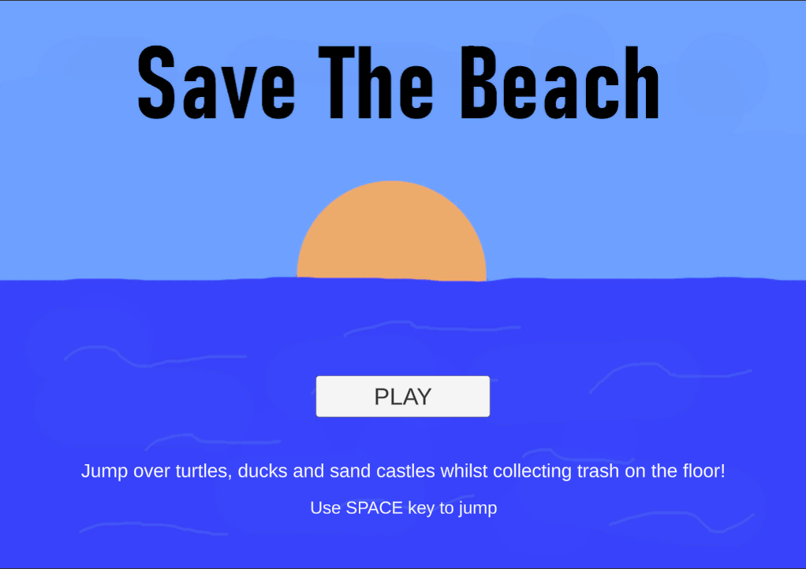
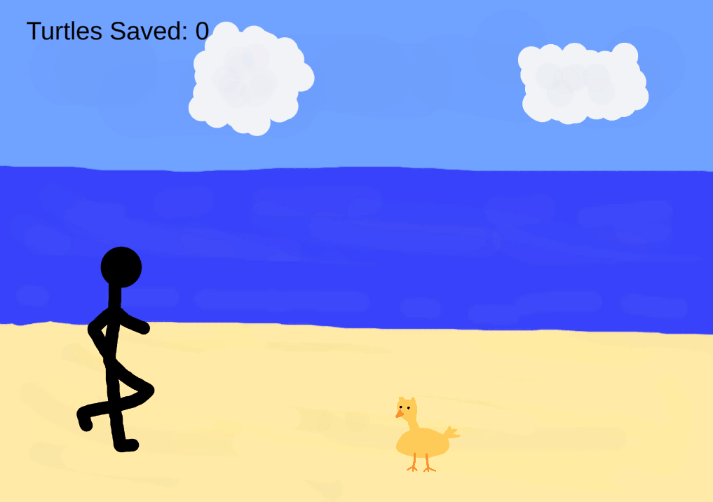
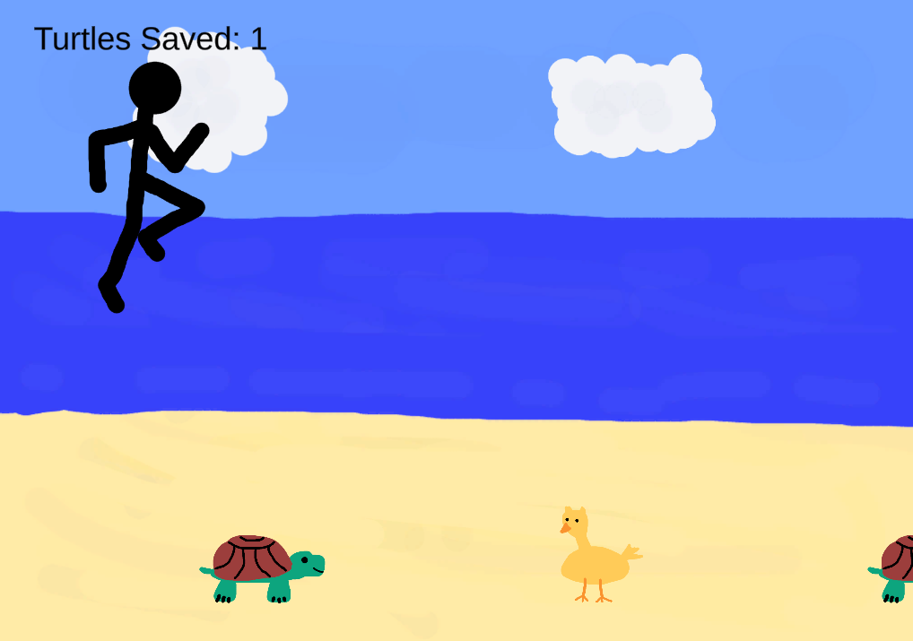

# Beach-Escape
This is my submission for "I Can't Draw But Want to Make A Game" Game jam 2020. It's a silly game where you play a character running on a beach, that collects trash of the floor whilst avoiding colliding with sand castles, turtles and ducks.

The game was created over the span of 48h. My main goal was to have fun and make a not-so-serious game! Hope you enjoy.

[Play Here in your web browser!](https://oktarian.itch.io/save-the-beach)

